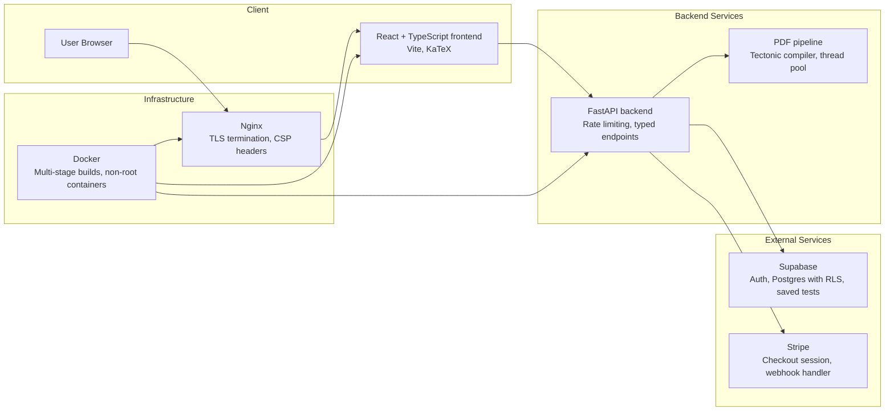
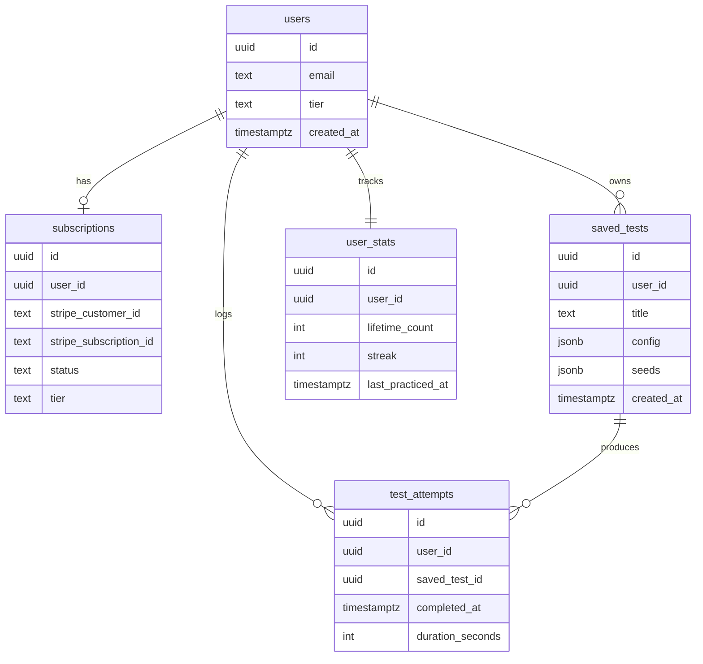
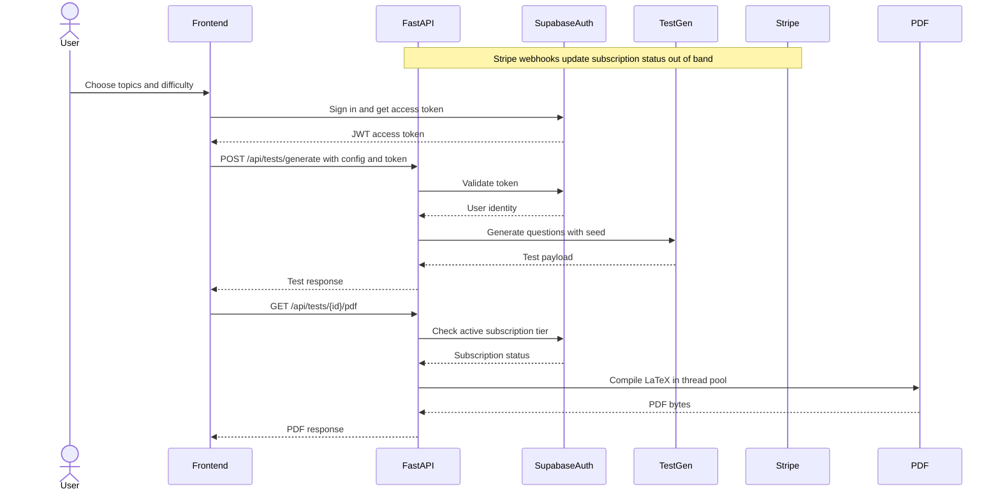
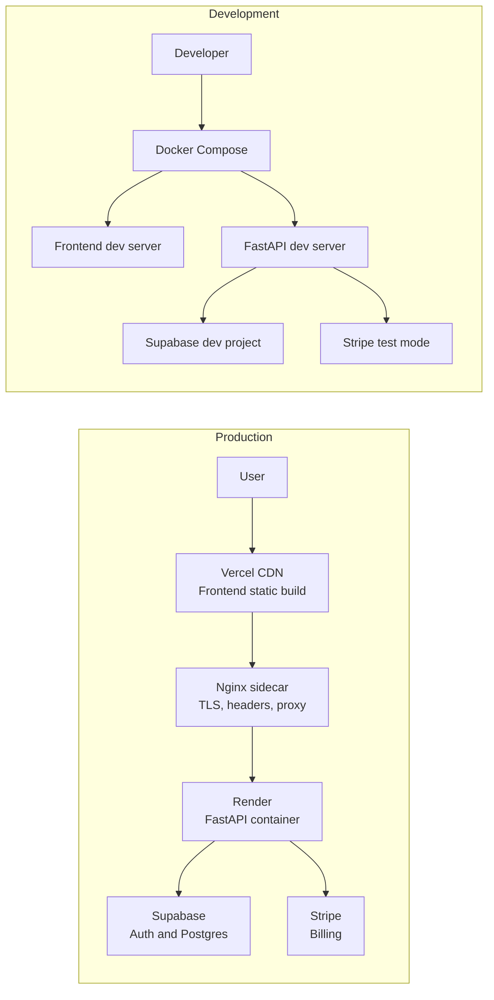

# Praxis
Praxis generates math practice tests for students and tutors who need consistent material and tracked progress.

## The Problem
Writing practice sets by hand is slow and uneven. Difficulty drifts, topic coverage shifts, and the same effort has to be repeated every week. Without a shared system, students cannot see how practice connects to progress.

## What Praxis Does
Praxis generates tests from topic and difficulty inputs, producing a repeatable mix that can be recreated from the same configuration and seed.

Each test can be exported as a PDF built from LaTeX, with optional answers and solutions for review or classroom use.

Tutor accounts can save tests and replay them later, keeping assignments consistent across sessions and reducing prep time.

User stats record lifetime test counts, per topic distribution, practice streaks, and recent timer data so progress is visible over time.

Stripe checkout and webhooks keep subscription status aligned with access rules in the API.

## Who It's For
Students get structured practice that stays consistent from one session to the next. They can generate new tests, review answers, and track progress without stitching together separate tools. The result is more time practicing and less time preparing.

Tutors get repeatable materials and a way to reuse proven test sets. They can save configurations, replay them for groups, and monitor how practice volume and topics shift over time. The outcome is less prep and more consistency across learners.

## Subscription Model
Praxis offers a student tier for on-demand test generation and PDF exports, and a tutor tier that unlocks saved tests and replay. Billing and plan changes run through Stripe, and the backend enforces the active tier on gated routes.

## Engineering
The product is direct to use, and the code keeps the same clarity in how responsibilities are separated.

### System Architecture Diagram


### Data Model / Entity Relationships


### Request Flow Diagram


### Deployment Topology
In the containerized production path, Nginx runs as a reverse proxy sidecar that terminates TLS and applies headers before forwarding requests to the FastAPI container. Nginx handles proxying while FastAPI enforces rate limits.


### Tech Stack Table
| Layer | Technology | Purpose |
| --- | --- | --- |
| Frontend | React, TypeScript, Vite | Renders the SPA, handles routing, and builds static assets. |
| Math rendering | KaTeX | Displays math notation in the browser. |
| Backend API | FastAPI | Serves typed endpoints for generation, billing, and stats. |
| Auth | Supabase Auth | Manages signup, login, and JWT validation. |
| Database | Supabase Postgres with RLS | Stores subscriptions, saved tests, and user stats with row level rules. |
| Billing | Stripe | Creates checkout sessions and handles webhook events. |
| PDF rendering | Tectonic | Compiles LaTeX into PDF responses in a worker thread pool. |
| Web server | Nginx | Serves static assets and applies CSP headers in production. |
| Containers | Docker | Builds multi-stage images for dev and production. |
| Local dev | Docker Compose | Runs the frontend and backend together for local work. |
| CI | GitHub Actions | Runs lint, tests, type checks, and frontend builds. |
| Hosting | Vercel, Render | Hosts the frontend build and the FastAPI service. |

### Local Development
Prerequisites: Docker and a `.env` file in the repo root.

Required environment variables:
- `SUPABASE_URL`
- `SUPABASE_ANON_KEY`
- `SUPABASE_SERVICE_ROLE_KEY`
- `SUPABASE_JWT_SECRET`
- `STRIPE_SECRET_KEY`
- `STRIPE_WEBHOOK_SECRET`
- `STRIPE_STUDENT_PRICE_ID`
- `STRIPE_TUTOR_PRICE_ID`

`SUPABASE_SERVICE_ROLE_KEY` is backend-only. Keep it out of the frontend and never commit it.

Run the stack:
```bash
docker compose up --build
```

Frontend: http://localhost:5173  
Backend health: http://localhost:8000/api/health

### Testing and CI
Local quality gates run through the Makefile. `make lint` runs Ruff and formatting checks for the backend and TypeScript type checks for the frontend. `make test-backend` runs pytest, and `make test-frontend` runs Vitest.

CI enforces the same lint and test steps plus a frontend production build. Backend tests must meet an 80% coverage threshold. No frontend coverage threshold is enforced because CI does not collect coverage metrics for Vitest.

```bash
make lint
make test-backend
make test-frontend
```

### Repository Structure
```
.
├── backend/        FastAPI service
├── frontend/       React SPA
├── docs/           Deployment guide
├── mockups/        UI mockups
├── specs/          Product specs
├── .github/        CI workflows
├── docker-compose.yml  Local stack
├── Makefile        Dev commands
```
